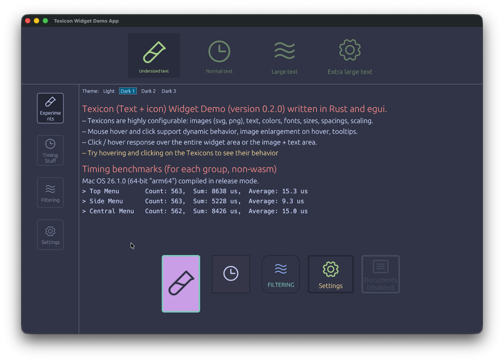

# Texicon — A Beautiful Icon + Text Button Widget for egui

**Texicon** is a highly customizable, stateful icon + text widget for **[egui](https://github.com/emilk/egui)** — perfect for toolbars, sidebars, dashboards, or any UI where you need clean, modern-looking clickable icons with optional labels and rich interaction states (normal, hover, selected).

It supports:
- Custom SVG/PNG images with tinting
- Multi-state coloring (normal / hover / selected)
- Optional text below the icon with automatic centering and wrapping
- Clickable image and/or text areas
- Full frame or image+text-only interaction sensing
- Tooltips with customizable position and gap
- Builder pattern for clean, fluent configuration

Ideal for desktop apps, tools, editors, and games built with `egui` + `eframe`.

## Screenshot



## Preview

* **[Live wasm browser example.](https://dreamy-meringue-f98d25.netlify.app/)**
* [egui app](https://github.com/White-Rabbit-Scientific/egui-widget-texicon-demo-app)

## Installation

Add to your `Cargo.toml`:

```toml
[dependencies]
texicon = { git = "https://github.com/white-rabbit-scientific/texicon.git" }
```

## Quick Start
```
use egui::{include_image, vec2, Align2};
use texicon::{TexiState, Texicon};

let mut state = TexiState::default();

let response = Texicon::new(&mut state)
    .texi_img(include_image!("../assets/save.svg"))
    .texi_text("Save".to_string())
    .texi_img_size(vec2(48.0, 48.0))
    .texi_text_size(14.0)
    .texi_tooltip_text(Some("Save the current document".to_string()))
    .ui(ui);

if response.clicked() {
    println!("Save clicked!");
    state.texi_selected = !state.texi_selected; // toggle selection
}
```

## Features & Customization

Texicon uses a fluent builder pattern — chain methods to style it exactly how you want:

```
Texicon::new(&mut state)
    .texi_img(include_image!("../assets/settings.svg"))
    .texi_img_size(vec2(40.0, 40.0))
    .texi_text("Settings".into())
    .texi_text_size(12.0)
    .texi_img_text_gap(8.0)
    .texi_top_gap(12.0)
    .texi_bottom_gap(12.0)
    .texi_bkgnd_col(Color32::from_black_alpha(40))
    .texi_bkgnd_col_hov(Color32::from_black_alpha(80))
    .texi_bkgnd_col_sel(Color32::from_rgb(70, 130, 220))
    .texi_img_tint(Color32::LIGHT_GRAY)
    .texi_img_tint_hov(Color32::WHITE)
    .texi_rounding(12.0)
    .texi_tooltip_text(Some("Open application settings".into()))
    .texi_sense(TexiSense::Frame) // or .ImageAndText
    .ui(ui);
```

### Interaction Modes (```TexiSense```)
* ```TexiSense::Frame``` — entire frame is clickable (default)
* ```TexiSense::ImageAndText``` — only image and text are clickable (great for dense layouts)

### State Management
Each Texicon binds to a TexiState which tracks:

```
pub struct TexiState {
    pub texi_being_hovered: bool,
    pub texi_selected: bool,
}
```

You own the state — perfect for radio groups, toggle buttons, or selected tools.

## Future ideas
* Add support for different fonts (RichText)

## Example: Toolbar with Selected State

```
ui.horizontal(|ui| {
    for (icon, label, selected) in &mut tools {
        let mut state = TexiState {
            texi_selected: *selected,
            ..Default::default()
        };

        let resp = Texicon::new(&mut state)
            .texi_img(icon.clone())
            .texi_text(label.clone())
            .texi_img_size(vec2(36.0, 36.0))
            .texi_sense(TexiSense::Frame)
            .texi_rounding(8.0)
            .ui(ui); // TODO

        if resp.clicked() {
            // Deselect all, select this one
            tools.iter_mut().for_each(|t| t.2 = false);
            *selected = true;
        }
    }
});
```

## License

Licensed under either of:
* Apache License, Version 2.0 (LICENSE-APACHE)
* MIT License (LICENSE-MIT)

at your option.

## Author
Made with ❤️ by White Rabbit Scientific

Inspired by modern design tools and clean UI patterns.

Star this repo if you like it! ⭐️
